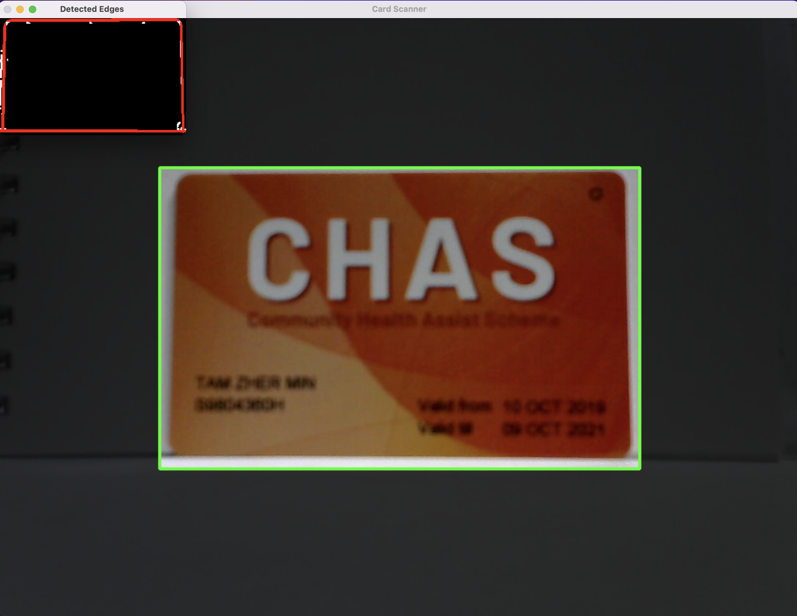
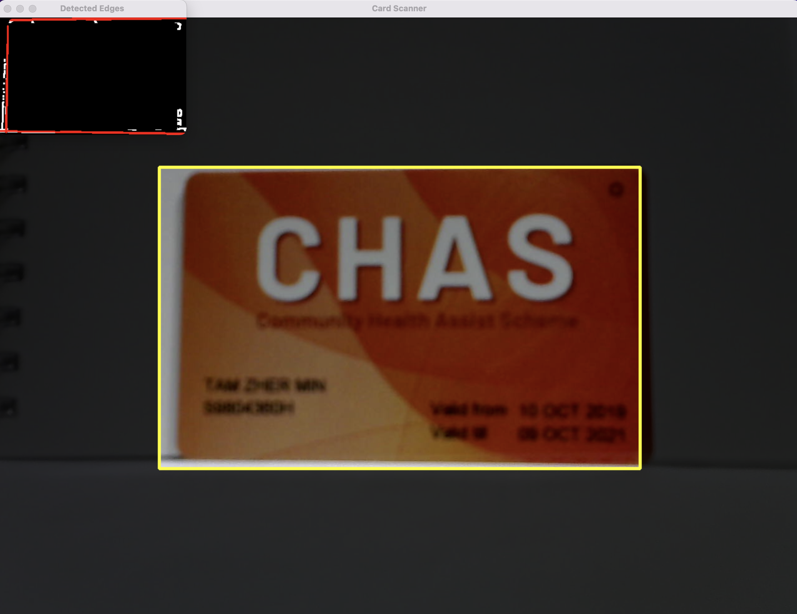
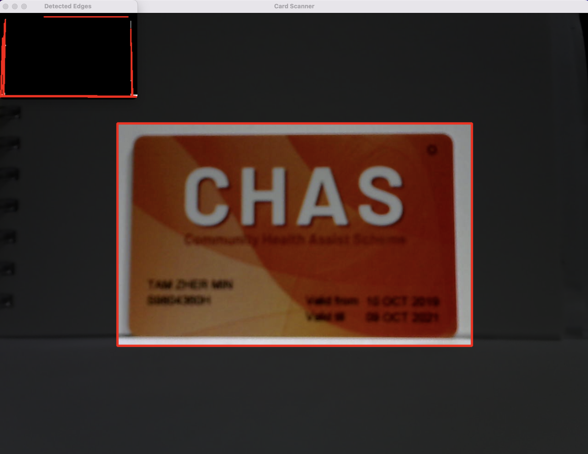

# CardScanner
A simple proof-of-concept real-time card scanner using Python and OpenCV based on an Android implementation by PQPO. 

## Application Flow
1. Initialize either a video file or webcam feed
2. Apply a rectangular mask over a frame to guide the card alignment for the user
3. Process the frame to highlight the lines
   1. Crop and scale down the frame for faster processing
   2. Increase the contrast and brightness if needed
   3. Convert to grayscale
   4. Apply a Gaussian blur to reduce noise
   5. Apply a Canny edge detector to detect edges
   6. Dilate the frame to strengthen the edges
   7. Binarize and apply OTSU thresholding to remove interference
4. Section off the image into 4 areas to check for lines
5. Use Probabilistic Hough Transform to find lines in each area
6. Check if the lines are long enough and vertical or horizontal enough for a card
7. Give visual feedback depending on number of edges found
   1. Green: All 4 edges found, most likely a card (although something at the center of the card will still be undetected)
   2. Yellow: Only 3 edges found, maybe the card is slightly misaligned or something is blocking one of the edges
   3. Red: Less than 3 edges found, not a card

<table>
    <tr>
        <td>Card Detected (All OK)</td>
        <td>3 Edges Detected (Readjust)</td>
        <td>No Card Detected (Fail)</td>
    </tr>
    <tr>
        <td></td>
        <td></td>
        <td></td>
    </tr>
 </table>

## Analysis

### Pros
- Relatively fast, around 10ms to process each frame (excluding frame reading due to library and device limitations)
- Simple to implement and understand, will help when writing the custom functions to do edge detection on mobile devices
- Uses the OpenCV library, which has support for both Python and C++, allowing a smoother transition to the custom Android APK POC
- Dim lighting is not as detrimental compared to glares as the edges can still be differentiated from the background

### Cons
- If colours of the card borders are similar to the background, it is very hard to detect the card
- Glare or strong light reflections causing the video feed to be completely white will also hinder the detection
- Because only edges are detected, if the card face is blocked by objects, it would still be detected as a card as long as the 4 edges are visible and unblocked
- As long as there is a colour difference, a line will be detected. This may result in false positives which will require further filtering (for example Card Type detection)

## Setup

### Installation
```bash
git clone gitlab@git.garena.com:shopee-ds/kyc/icas/intern/zac-tam-zher-min/cardscanner.git
cd cardscanner
pip install -r requirements.txt
```

### Usage
```bash
python main.py
    --cam <cam ID, default=0>
    --preview <0/1 off/on mini-preview of the detected edges>
    --file <path to image or video file instead of webcam>
```

### Configs
Changes to parameters can be done in the `main.py` script directly. The configs can be pulled out into a YAML config file instead but for simplicity, this was done instead. 

**Note:** Houghlines params are based off of a hard-coded max size of 300
```python
PARAMS = {
    "max_size": 300,  # scaled down image for faster processing
    "mask_aspect_ratio": (86, 54),  # CR80 standard card size is 86mm x 54mm
    "inner_mask": False,  # shows an inner rectangle mask to the user
    "mask_alpha": 0.8,  # opacity of the mask
    "frame_scaling_factor": 0.6,  # ratio of unmasked area to the entire frame
    "alpha_contrast": 1.5,  # higher value = more contrast (0 to 3)
    "beta_brightness": 0,  # higher value = brighter (-100 to 100)
    "gaussian_blur_radius": (3, 3),  # higher radius = more blur
    "canny_threshold1": 20,
    "canny_threshold2": 50,
    "dilate_structing_element_size": (3, 3),  # larger kernel = thicker lines
    "OTSU_threshold_min": 0,
    "OTSU_threshold_max": 255,
    "houghlines_threshold": 100,  # minimum intersections to detect a line
    "houghlines_min_line_length": 50,  # minimum length of a line
    "houghlines_max_line_gap": 50,  # maximum gap between two points to form a line
    "area_detection_ratio": 0.1,  # ratio of the detection area to the image area
    "min_length_ratio": 0.9,  # ratio of lines to detect to the image edges
    "angle_threshold": 10,  # in degrees
}
```

## Based On: SmartCamera by PQPO

[SmartCamera Repo](https://github.com/pqpo/SmartCamera)  
[Implementation Docs](https://pqpo.me/2018/09/12/android-camera-real-time-scanning/)

### Overview of this SDK
- Last updated ~2019, using tech from ~2018-2019, around 3-4 years ago
    - Outdated library (depreciated in 2019): Google’s open source CameraView
    - More updated Android Camera API: [Jetpack CameraX](https://developer.android.com/jetpack/androidx/releases/camerax)
- CameraView & CameraX are Android APIs to use the smartphone’s cameras to get the video stream
- A bit hard to fully understand the code because it is mostly in Java
- If want to implement for iOS or cross-platform will need to find the SDKs/APIs for the camera stream for iOS and Android for the correct platform (eg. Swift for iOS or React Native/Flutter for cross-platform)

#### Pros
- Simple and fast, using only OpenCV to process image without deep learning, good for mobile
- Can use the same techniques to detect edges using OpenCV for our own implementation

#### Cons
- Project is not updated anymore and is using old libraries
- Only works for Android because it is using Android-specific APIs

### How It Works (Based on my own understanding of PQPO’s docs)
1. Capture the video stream from smartphone using the Android Camera API
2. The output from the API is a frame buffer
    1. Each frame is in the format “YCbCr_420_SP (NV21)” or “YUV 4:2:0 sampling”
    2. To allow OpenCV to process the YUV formatted image, convert it to “Mat format”
    3. Convert it to a greyscale or black & white image and rotate the image if needed
3. Crop out the rectangular area from the image based on (maskX, maskY, maskWidth, maskHeight) and scale it down using (scaleRatio)
4. Perform Edge Detection & Extraction algorithm using OpenCV
    1. Apply Gaussian Blur `GaussianBlur()` to remove noise
    2. Use the `Canny()` operation to detect edges
    3. Use the `dilate()` operation to strengthen edges
    4. Binarise and threshold the image using `threshold()` to remove interference
5. Verify if image is a card
    1. Divide image into 4 detection areas (top, bottom, left, right), say, 10% away from the edges of the rectangular mask
    2. Detect all the lines in the 4 general areas
    3. Determine whether there are enough lines that meet the conditions for each area by checking their lengths and angles (vertical/horizontal)
6. Finally if all 4 areas pass the checks, the image is considered a card and a photo is automatically captured and saved
