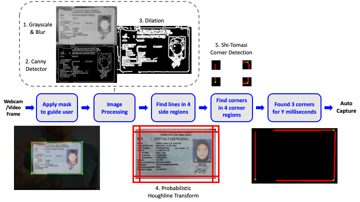

# [TD] Identity Card Edge/Corner Detection
`Algorithm Engineer: Zac Tam Zher Min`\
`Supervisor: Yan Xuyan`

<details open>
<summary>Table of Contents</summary>

- [Introduction](#introduction)
- [Requirement](#requirement)
- [Scenarios to be Accepted or Rejected by the Model](#scenarios-to-be-accepted-or-rejected-by-the-model)
- [General Use-Case Demo](#general-use-case-demo)
- [Model Development (Pure OpenCV Implementation)](#model-development-pure-opencv-implementation)
- [Analysis](#analysis)
    - [Pros](#pros)
    - [Cons](#cons)
    - [Major Con: The OpenCV Library](#major-con-the-opencv-library)
        - [Currently: Use OpenCV as is](#currently-use-opencv-as-is)
        - [Replace OpenCV functions with custom implementation](#replace-opencv-functions-with-custom-implementation)
        - [Train a small NN model to classify a valid image (3 corners detected)](#train-a-small-nn-model-to-classify-a-valid-image-3-corners-detected)
- [Tuneable Parameters](#tuneable-parameters)
- [Model Performance Evaluation](#model-performance-evaluation)
- [Sources](#sources)
    - [Competitor Research](#competitor-research)
        - [Overview of this SDK](#overview-of-this-sdk)

</details>

# Introduction

This TD showcases a simple real-time card detector using non-deep learning, purely image processing OpenCV solution based on an open-source Android implementation on GitHub by using edge and corner detection to identify "cards". The goal is to then convert from the Python POC to a C++ API to be implemented in an APK, whereby the automatically captured image of the detected card will be passed to the e-KTP card type, flip and quality checks. 

The whole model development processes are shown as below, taking an e-KTP card as an example:

1. Use some traditional image processing methods to detect environment light condition, **if there is enough light, go to the next step**
2. Use Edge Detection model to capture the card edge, **if "at least 3 corners of the card are visible within the guided viewfinder", then image is captured, and send the image (the whole card with almost no background information) will go to the next step**
3. Develop card type check model, **if confirm the card is KTP, then go to the next step**
4. Develop card flip check model, **if confirm the card is in right direction, then go to the next step**
5. Develop card quality check model, **if confirm the card is not blurry, block..., then go to the next step**

This TD aims to handle the **Edge Detection** step amidst the entire e-KTP Auto Scanning pipeline shown above. 

# Requirement

The target of this IC Edge Detection model is to allow **"at least 3 corners of the card are visible within the guided viewfinder"** before the process moves to the next step, "Card Type Check". 

# General Use-Case Demo


# Scenarios to be Accepted or Rejected by the Model

**Note:** Due to the low resolution of the webcam and low quality of the printed KTP card used in the video demos below, the words on the sample KTP card will not be very legible

|     |     |     |     |     |
| --- | --- | --- | --- | --- |  
| Scenario | Condition(s) | Expected Handling (Auto-Capture Decision) | Demo Video | Remarks |
| Happy Flow | All 5 critical requirements are met | Auto-capture should be triggered as it fulfils all 5 critical requirements:<br><br>1. Card is ID e-KTP; AND<br>2. Card is generally free of quality issue (not blurry, not blocked); AND<br>3. At least 3 corners of the card are visible within the guided viewfinder; AND<br>4. Well-lit condition (good lighting; not too dark, not too bright that it diminishes card details); AND<br>5. Card position is in a proper angle<br><br>Auto-capture should be triggered |  |     |
| At least 3 corners of the card are visible within the guided viewfinder | Only 1 corner blocked | Auto-capture should be triggered as it fulfils all 5 critical requirements |  | The model will auto-capture even if the object is blocking the center of the card with the key information as long as it detects 3 corners |
| Less than 3 corners of the card are visible within the guided viewfinder | 2 corners blocked by object | Auto-capture should not be triggered as "at least 3 corners of the card is visible" is a critical requirement |  |     |
|     | 3 corners blocked by object | Auto-capture should not be triggered as "at least 3 corners of the card is visible" is a critical requirement |  |     |
|     | Card is not horizontally aligned to the guided viewfinder | Auto-capture should not be triggered as "at least 3 corners of the card is visible" is a critical requirement |  |     |
|     | Card is not vertically aligned to the guided viewfinder | Auto-capture should not be triggered as "at least 3 corners of the card is visible" is a critical requirement |  |     |
|     | Card is too zoomed out, skewed or slanted away from the guided viewfinder | Auto-capture should not be triggered as "at least 3 corners of the card is visible" is a critical requirement |  |     |
| **Edge Scenario** | **Condition(s)** | **Expected Handling (Auto-Capture Decision)** | **Demo Video** | **Remarks** |
| Noisy backgrounds | Example: If holding the card in hand or on a background with many lines or dots | Auto-capture should be triggered as it fulfils all 5 critical requirements |  | This may not always auto-capture and some adjustments by the user may have to be made as the model may face difficulty in such scenarios especially if the user does not fully align the card in the guided viewfinder |
| Similar coloured backgrounds | In the case of the KTP, a similar background colour would be blue and light backgrounds | Auto-capture should be triggered as it fulfils all 5 critical requirements |  | This may not always auto-capture and the user might have to position the card in front of a different background or try to hold it in hand |
| Low exposure | General poor lighting conditions | Auto-capture should not be triggered as "well-lit condition (good lighting; not too dark, not too bright that it diminishes card details)" is a critical requirement |  | The model will still auto-capture if it can detect the 3 corners because it does not take into account the lighting conditions although the user should reposition to a better lighting condition |
| Strong shadows blocking card features, resulting in poor lighting conditions | Shadows cast by the user or objects in the way of the light source | Auto-capture should not be triggered as "well-lit condition (good lighting; not too dark, not too bright that it diminishes card details)" is a critical requirement |  | As above |
| High exposure blocking card features | Direct exposure to light source | Auto-capture should not be triggered as "well-lit condition (good lighting; not too dark, not too bright that it diminishes card details)" is a critical requirement |  | As above |
| Glare blocking card features | Direct exposure to light source | Auto-capture should not be triggered as "well-lit condition (good lighting; not too dark, not too bright that it diminishes card details)" is a critical requirement |  | As above |

# Model Development (Pure OpenCV Implementation)



1. Initialise either a webcam feed or video file
2. Apply a rectangular mask over a frame to guide the card alignment for the user (handled on the app frontend)
3. Process the frame to highlight the lines
    1. Crop and scale down the frame for faster processing
    2. Convert to grayscale
    3. Apply a **Gaussian blur** to reduce noise
    4. Apply a **Canny edge detector** to detect edges
        * The Canny edge detector is an image processing algorithm that takes in two parameters: a lower bound and upper bound
        * The algorithm will then reject pixels if the pixel gradient is below the lower bound and accept instead if the gradient is above the upper bound
        * If the gradient falls between these two bounds, the pixels will only be accepted if they are connected to pixels that are above the upper bound
        * The 5-step Canny edge detector algorithm (From [Wikipedia](https://en.wikipedia.org/wiki/Canny_edge_detector)):
            1. Apply Gaussian filterto smooth the image in order to remove the noise (Repeat of previous step)
            2. Find the intensity gradients of the image
            3. Apply gradient magnitude thresholding or lower bound cut-off suppression to get rid of spurious response to edge detection
            4. Apply double threshold to determine potential edges
            5. Track edge by [hysteresis](https://en.wikipedia.org/wiki/Hysteresis "Hysteresis"): Finalise the detection of edges by suppressing all the other edges that are weak and not connected to strong edges
        * 
        * The use of two thresholds with hysteresis allows more flexibility than a single-threshold approach, but general problems of thresholding approaches still apply
        * A threshold set too high can miss important information but a threshold set too low will falsely identify irrelevant information (such as noise) as important
        * It is difficult to give a generic threshold that works well on all images and no tried and tested approach to this problem yet exists as the thresholds are not dynamic during runtime
    5. Apply **Dilation** to thicken the edges so the lines are more easily found
        * Based on a set sized window, eg. a 3x3 window, if within the window, at least 1 pixel is found to be non-black, it will colour the center of the window white
        * This gives the effect of fattening the non-black regions
        * 
4. Check for lines
    1. Section off the image into 4 areas: left, right, top and bottom
    2. Use **Probabilistic Houghline Transform** to find lines in each area by checking if each potential line meets 3 conditions:
        1. The number of intersection between curves (obtained using the mathematical polar coordinate representation of a line) meets a certain threshold
            * 
        2. Each potential line found must be long enough
        3. The gaps between potential lines must be short enough to be considered a single line
5. Check for corners
    1. Section off the image into the 4 corners: top left, top right, bottom left and bottom right
    2. Apply **Shi-Tomasi corner detection** to find corners in the 4 corner regions from the found lines
        * At most 1 corner (set parameter) can be found by this algorithm
        * This "corner" detection algorithm does not necessarily detect corners with a certain angle
        * Rather, it finds regions of interest based on the pixel differences illustrated below, where red areas are equivalent to the "edges" and the entire green region is considered a corner if the region score _R_ is above a set parameter
        
        * Hence, even for straight-looking lines, it may sometimes falsely identify it as a corner regardless of how strict the corner detection parameter is set (from 0 to 1)
        * The Shi-Tomasi algorithm is an improved "corner" detection algorithm to the Harris algorithm, although both face the same problems stated above
6. Card is found if at least 3 corners found and be considered a "valid frame"
7. Automatically captures the video frame after some Y milliseconds or the equivalent in some number of consecutive "valid frames" (depending on the device FPS)

# Analysis

## Pros

* Relatively fast, around 10ms to process each frame for the Python implementation (excluding frame reading due to library and device limitations)
* Dim lighting is not as bad compared to glares as the edges can still be differentiated from the background
* If colours of the card borders are similar to the background, it will be harder to detect but still possible if parameters tuned to be sensitive
* Relatively straightforward to understand and implement if utilising OpenCV, using only around 5 key image processing algorithms excluding standard image processing steps such as cropping, scaling and grayscale

## Cons

* Glare or strong light reflections causing certain areas of the frame to be completely white may hinder the detection
* If someone is holding the card in their hand or is generally in a noisy background, it can be hard to detect as well because the non-card lines can throw the model off
    * We can prompt user to place the card flat on a surface before scanning
* The "corner" detection method also detects curves, which can cause false positives for the corners even if a corner is blocked
    * This can be somewhat mitigated by adding the short delay before auto capture (some number of consecutive valid frames)

## Major Con: The OpenCV Library

The OpenCV library takes up a lot of space (PC version is 500MB-1GB), even a minimal build with the key libraries for mobile devices will likely still take up 10+MB. The existing SeaBanking app as I understand from is also not currently using OpenCV. Here are some possible solutions:

### Currently: Use OpenCV as is

For prototyping v0.1, OpenCV was used as is, with most or all of the libraries included. This allows for easy testing and tuning as there is no worry about missing features or managing requirements. However, this will not be an option in the future as the overall SDK size increment limit is currently set to be 3MB. 

### Replace OpenCV functions with custom implementation

Recommended by , we can replace existing functions such as Canny edge detector with a custom C++ open-sourced implementation. This will take some time and effort in researching and linking them up together to work as well as the current OpenCV prototype, which might impact performance. 

### Train a small NN model to classify a valid image (3 corners detected)

Since the rest of the steps in the Auto Capture pipeline (Card Type/Flip and Quality Check) does not use OpenCV and are instead NN-based, we can completely eliminate the use of OpenCV along the entire pipeline and just use some simple custom image input and output functions to feed into the small MNN model. This is similar to the strategy employed by the Aurora Liveness Check app, which is purely NN-based as well. This app was highlighted by , since he will also be using this technique for the Card Type Check model. This approach will also require some time and effort to gather training data and train the model. 

# Tuneable Parameters

**Note:** Ratio parameters are based off of the `max_size`  parameter (default = 300 pixels), actual values are in round brackets in the comments
```python
PARAMS = {
    "max_size": 300,                       # width of scaled down image for faster processing
    "frame_scaling_factor": 0.6,           # ratio of unmasked area to the entire frame (180)
    "mask_aspect_ratio": (86, 54),         # CR80 standard card size is 86mm x 54mm
    "gaussian_blur_radius": 5,             # higher radius = more blur
    "canny_lowerthreshold_ratio": 0.03,    # rejected if pixel gradient below lower threshold (9)
    "canny_upperthreshold_ratio": 0.10,    # accepted if pixel gradient above upper threshold (30)
    "dilate_structing_element_size": 3,    # larger kernel = thicker lines
    "houghline_threshold_ratio": 0.5,      # minimum intersections to detect a line (150)
    "houghline_minlinelength_ratio": 0.2,  # minimum length of a line (60)
    "houghline_maxlinegap_ratio": 0.005,   # maximum gap between two points to form a line (2)
    "area_detection_ratio": 0.15,          # ratio of the detection area to the image area (45)
    "corner_quality_ratio": 0.99,          # higher value = stricter corner detection
    "y_milliseconds": 200,                 # number of milliseconds to wait for valid frames
}
```

# Model Performance Evaluation

For the model performance evaluation, we will target these metrics:

* Size: Total size of the model and if including imported libraries, if any
* Speed: Time to process each frame
* Accuracy: Auto-capturing when it is supposed to ("Predicted" Positives)
* Stability: NOT auto-capturing when it is not supposed to ("Predicted" Negatives)

|     |     |     |     |     |     |
| --- | --- | --- | --- | --- | --- |  
|     | Pure Model Size | Model Size with OpenCV Lib | Speed | Accuracy | Stability |
| Edge Detection v0.1 |     |     |     |     |     |
| Edge Detection v0.2 |     |     |     |     |     |
| Edge Detection v0.3 |     |     |     |     |     |
| Edge Detection v0.4 |     |     |     |     |     |

# Sources

## Competitor Research

* [SmartCamera Repo](https://github.com/pqpo/SmartCamera)
* [Implementation Docs](https://pqpo.me/2018/09/12/android-camera-real-time-scanning/)

### Overview of this SDK

* Library overall is written in both Java and C++ with the help of OpenCV (but the file size is big because they imported most or all of the libraries)
* The repository was last updated ~2019, using a depreciated Android camera library from ~2018-2019, around 3-4 years ago
    * Outdated camera library (depreciated in 2019 but still functions): Google’s open source CameraView
    * More updated Android Camera API: [Jetpack CameraX](https://developer.android.com/jetpack/androidx/releases/camerax)
    * CameraView & CameraX are Android APIs to use the smartphone’s cameras to get the video stream, the rest of the implementation works fine till this day